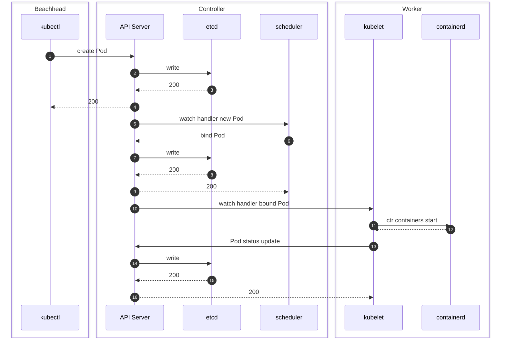
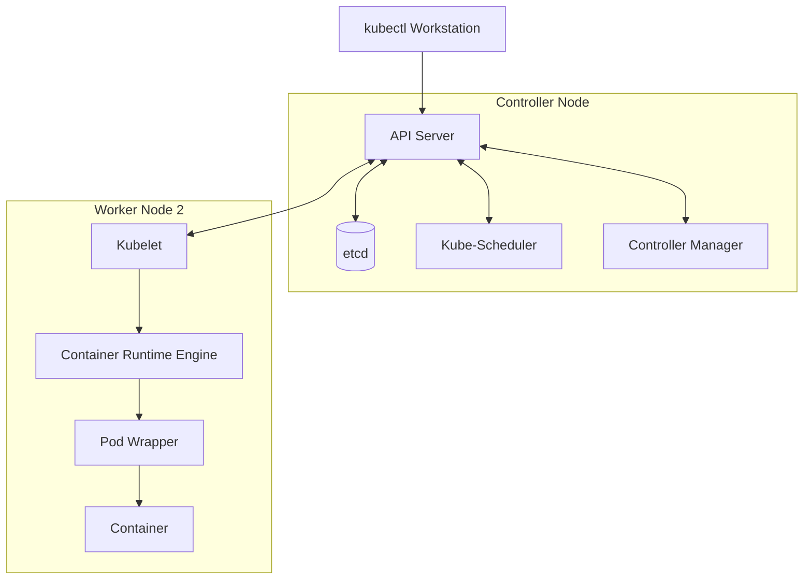
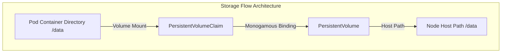
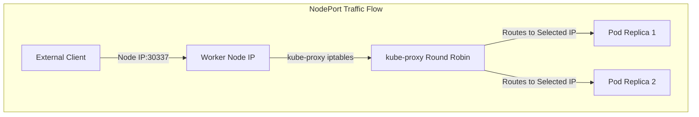

**1.The Goal (Cleaned Verbatim)**

* Go through all of the fundamentals of Kubernetes, everything that you need as a foundation to pass your CCAD or your CKA exam, or if you're just looking to get proficient with Kubernetes in general.

---

**Why Use Kubernetes**

* Kubernetes is all about enabling a certain sort of lifestyle in application deployment.
	* We have some code along with dependencies that are needed in order for that code and its application to run in a style of application deployment known as microservices.
	* Let's put all of that code and its dependencies inside of an isolated environment called a container.


* Containers come with a whole bunch of advantages:
	* It's really easy to spin up containers.
	* It's really easy to replace containers, meaning updating or making changes to these applications can be done in a snap.
	* work on my computer & everywhere else too.
	* Containers are scalable, allowing you to create as many different copies of them as you want.


* Containers are not meant to hang around forever, whether they die because you tear them down or because something happens to them.
* Traditional container management without Kubernetes leads to disaster scenarios:
	* Scenario number one: your host machine runs out of resources, and containers may not be able to expand.
	* Issue number two: containers die and they get ignored.
	* Scenario number three: all these containers are running on the same virtual machine, so if your virtual machine dies, all those containers just went down with it and there's nothing set up to bring those back.
	


---

**Pods Nodes And The Cluster**

* Containers in Kubernetes work exactly the same way they always did, whether created by Docker or something else.
* Kubernetes containers are placed inside of Kubernetes objects called pods.
	* Pods are really just wrappers that are being placed around containers.
	* Kubernetes manages pods, not containers.
	

* In a Kubernetes environment, virtual machines are called nodes.
	* You can add multiple nodes to the same environment to exponentially increase the total amount of resources.
	* When you combine all of those nodes together, you get what are called a cluster.


* Worker nodes are where you would expect to see the vast majority of pods created.
* The controller node is the hub of all the tools required to keep your cluster running.

---

**Control Plane Architecture And CLI**

* `kubectl` / `kube-control` is the CLI tool installed on your personal workstation or laptop, `enabling you to access the cluster.`
* All `kubectl` requests are received by the API Server because `all communication inside of Kubernetes is done through an API.`
* A `kubeconfig` file sitting on your laptop, includes the `location of the cluster` along with the `certificate and key files` required to `authenticate and talk to that cluster.`
* `API Server` talk to `external systems` via 'kubectl'. The `API Server` `take request, authenticate, authorize & vaidate request & return response back to `kubectl`.`
* `API Server` talk to `every single worker node` via 'kubelet'.
* `API Server` talk to `persistent state of object` via 'etcd'. ``API Server` is the only component that talks to `etcd`.`
* `etcd` (third party) is a `strongly consistent distributed key-value store` that provides a reliable way `to store data accessed by a distributed system or a cluster of machines.`
* ``etcd` is the only one datastore of the k8s cluster. It stores & replicates all k8s cluster states.`
* The `scheduler` makes the decision `put this pod on this node`, aiming for equal distribution across the nodes. Once pod is placed on a node, scheduler is done. kubelet takes on to deploy & observe pod.
* The `Controller Manager` is a daemon that manages controllers inside the master node.
	* replication controller.
 	* endpoints controller.
	* namespace controller.
	* aervice-accounts controller.
* `The controller manager manages a lot of different daemons that control the behavior of how your cluster runs, such as tracking namespaces, role-based access control, and replicas.`
* `kubelet` is present on every single node and acts like the eyes and ears of the node, making sure that containers are started, stopped, or restarted appropriately.
* Every single node has some container runtime engine like Docker, and `kubelet` handles running container runtime commands.
* Container life cycles still apply, requiring an image template and a container registry for storage.
* watch at 16 min for below diagram - https://youtu.be/MTHGoGUFpvE?si=r4vNFV6JufZ1t4W7

```markdown


```

---

```text

   kubectl    |   API Server             etcd              scheduler           kubelet      	containerd
      |       |       |                   |                    |                  |             	|
      |--create Pod-->|                   |                    |                  |             	|
      |       |       |------write------->|                    |                  |             	|
      |       |       |<-------200--------|                    |                  |             	|
      |<--200---------|                   |                    |                  |             	|
      |       |       |                   |                    |                  |             	|
      |       |       |-------------watch handler new Pod----->|                  |             	|
      |       |       |<-------------------bind Pod------------|                  |             	|
      |       |       |------write------->|                    |                  |             	|
      |       |       |<-------200--------|                    |                  |             	|
      |       |       |--------------------200---------------->|                  |             	|
      |       |       |                   |                    |                  |             	|
      |       |       |----------------------watch handler bound Pod------------->|                 |
      |       |       |                   |                    |                  |                 |
      |       |       |                   |                    |                  | ctr containers  | start
      |       |       |                   |                    |                  |-------------->	|
      |       |       |                   |                    |                  |             	|
      |       |       |                   |                    |                  |<--------------- |
      |       |       |<---------------------Pod status update--------------------|             	|
      |       |       |------write------->|                    |                  |             	|
      |       |       |<-------200--------|                    |                  |             	|
      |       |       |------------------------200------------------------------> |             	|

```
 

---

**YAML Fundamentals**

* A manifest provides a list of descriptions of the things that you want.
* Manifests are written in YAML, which makes data readable to human eyeballs.
* Lists or sequences are represented where every item has a dash in front of it. like eggs, milk, break, butter, chicken.
	* \- eggs
	* \- milk
	* \- break
	* \- butter
	* \- chicken
* Dictionaries or mappings are `key-value` pairs separated by colons.
	* flavour: yummy
	* brand: nestle
	* expiration: 26 july 2026
	* tasty: true
	* calories:1000
* Indentation is critically important in YAML because it implies ownership and nested values.

---

**Basic Pod Management**

* Pod manifests include three primary values at the top: `apiVersion`, `kind`, and `metadata`.
	* `kind` tells us what kind of object we are working with and is case-sensitive.
	* `metadata` contains items like labels indented underneath it.
	* `apiVersion` indicates the API responsible for recognizing and configuring specific resource types.
	* `spec` (specification) is where you define how you want your object to be built.


* Instructor's Quote: "We are going to create a manifest here. Pod manifest.yaml and we're going to paste in that manifest that we were looking at earlier."
*
* **kubectl create <resource_type> <resource_name> [OPTIONS] --dry-run=client -o yaml > <filename>.yaml**
*
* Note: For resources that use kubectl **run instead of kubectl create**, such as **Pods**, the flags remain identical.
  	* **kubectl run my-pod --image=nginx --dry-run=client -o yaml > pod.yaml**
	*
* Core Formula Rules
	* **--dry-run=client**: Tells kubectl to generate the manifest locally without making an API request to the cluster.
	* **-o yaml**: Outputs the generated resource structure in YAML format.
	* **> <filename>.yaml**: Redirects the YAML output into a local definition file.
    *
* 1. Pod
	* **kubectl run my-pod --image=nginx --dry-run=client -o yaml > pod.yaml**
* 2. Service
	* ClusterIP (Default):
	* **kubectl create service clusterip my-svc --tcp=80:80 --dry-run=client -o yaml > svc-clusterip.yaml**
	*
	* NodePort:
	* **kubectl create service nodeport my-svc --tcp=80:80 --dry-run=client -o yaml > svc-nodeport.yaml**
	*
	* Expose directly from a Pod/Deployment:
	* **kubectl expose deployment my-deploy --name=my-svc --port=80 --target-port=8080 --type=ClusterIP --dry-run=client -o yaml > svc.yaml**
	*
* 3. Namespace
    * 
	* **kubectl create namespace my-namespace --dry-run=client -o yaml > ns.yaml**
	*
* 4. ConfigMap & Secret (Config)
	* ConfigMap:
	* **kubectl create configmap my-config --from-literal=KEY=VALUE --dry-run=client -o yaml > cm.yaml**
	* Secret:
	* **kubectl create secret generic my-secret --from-literal=password=secret123 --dry-run=client -o yaml > secret.yaml**
	*
* 5. Deployment
	* 
	* **kubectl create deployment my-deploy --image=nginx:1.26 --replicas=3 --dry-run=client -o yaml > deployment.yaml**
	*
* 6. Job & CronJob
	* Job:
	* **kubectl create job my-job --image=busybox -- /bin/sh -c "echo Hello" --dry-run=client -o yaml > job.yaml**
	*
	* CronJob:
	* **kubectl create cronjob my-cronjob --image=busybox --schedule="*/5 * * * *" -- /bin/sh -c "date" --dry-run=client -o yaml > cronjob.yaml**
	*
* 7. ServiceAccount & Role / RoleBinding (RBAC)
	* ServiceAccount:
	* **kubectl create serviceaccount my-sa --dry-run=client -o yaml > sa.yaml**
	*
	* Role:
	* **kubectl create role pod-reader --verb=get,list,watch --resource=pods --dry-run=client -o yaml > role.yaml**
	*
	* RoleBinding:
	* **kubectl create rolebinding read-pods --role=pod-reader --serviceaccount=default:my-sa --dry-run=client -o yaml > rolebinding.yaml**
	
* 8. Resources Without Direct kubectl create Subcommands
	* Some complex resources (**Node, ReplicaSet, StatefulSet, DaemonSet, PersistentVolume, Ingress** do **not have dedicated kubectl create** <kind> imperative commands.
	* 
	* For these resources, use one of the two standard practices:
	* 
	* Method A: Extract from an Existing Cluster Resource
	* If the resource already exists in your cluster (e.g., a Node or an existing DaemonSet), export its structure directly and strip metadata:
	* kubectl get node <node-name> -o yaml > node.yaml
	* kubectl get statefulset <sts-name> -o yaml > statefulset.yaml
	* kubectl get daemonset <ds-name> -o yaml > daemonset.yaml
	* kubectl get replicaset <rs-name> -o yaml > replicaset.yaml
	* Method B: Convert a Deployment Manifest
	* Because DaemonSets, StatefulSets, and ReplicaSets share almost identical spec.template structures with Deployments:
	* 
	* Generate a Deployment manifest:
	* 
	* Bash
	* kubectl create deployment my-workload --image=nginx --dry-run=client -o yaml > workload.yaml
	* Open workload.yaml and edit:
	* 
	* Change kind: Deployment to kind: StatefulSet (and add serviceName: <svc-name>)
	* 
	* Change kind: Deployment to kind: DaemonSet (and remove spec.replicas).
    * 
```yaml
			apiVersion: v1
			kind: Pod
			metadata:
			  creationTimestamp: null
			  labels:
			    run: my-pod
			  name: my-pod
			spec:
			  containers:
			  - image: nginx
			    name: my-pod
			    resources: {}
			  dnsPolicy: ClusterFirst
			  restartPolicy: Always
			status: {}

```


* 💡 AI Description: `Defines a basic Kubernetes Pod resource manifest running an Nginx container.`
* Instructor's Quote: "I would like to apply what is at this file location -f pod manifest.yaml... and if that pod doesn't exist, kubectl apply will create it."
```bash
	kubectl apply -f pod-manifest.yaml

```


* 💡 AI Description: `Creates or updates Kubernetes cluster resources defined inside a specific YAML file.`
* Instructor's Quote: "Let's do a cube control get pods."
```bash
	kubectl get pods

```


* 💡 AI Description: `Lists all active pods running within the current namespace.`
* Instructor's Quote: "I'm going to describe that pod that I just made called engine X."
```bash
	kubectl describe pod engine-x

```


* 💡 AI Description: `Retrieves detailed status, configuration, and event history for a specific pod.`
* Instructor's Quote: "We could use cube control delete with that file... or you can always just cube control delete. Specify what type of object you're deleting, a pod, and then what's the name of the pod you're trying to delete?"
```bash
	kubectl delete -f pod-manifest.yaml
	** OR
	kubectl delete pod engine-x

```


* 💡 AI Description: `Deletes a Kubernetes object either by referencing its source manifest file or its resource identifier.`

---

**Namespaces And Resource Quotas**

* Namespaces allow you to isolate and organize objects so they do not get mixed up with system resources or other projects.
* System integral pods run inside separate system namespaces like `kube-system`.
* Imperative commands can quickly generate objects at the command line without using a manifest file.
* A resource quota attaches to a namespace to set hard consumption limits on total CPU and memory usage.
* Instructor's Quote: "When I type cube control get pods, but this time I specify -ashn for namespace. And let's take a look at cube system."
```bash
	kubectl get pods -n kube-system

```


* 💡 AI Description: `Lists all pods running inside the specified system namespace.`
* Instructor's Quote: "In fact, let's create this namespace and let's just call it demo."
```bash
	kubectl create namespace demo

```


* 💡 AI Description: `Creates a new isolated namespace named demo.`
* Instructor's Quote: "Resource quotas attached to namespaces. So instead of writing that under metadata, I'm just going to type dash N demo."
```bash
	kubectl create quota mem-cpu-demo --hard=requests.cpu=1,requests.memory=1Gi,limits.cpu=2,limits.memory=2Gi -n demo

```


* 💡 AI Description: `Enforces strict CPU and memory resource consumption caps across a specific namespace.`

---

**API Versioning And Cluster Upgrades**

* When upgrading Kubernetes, you are upgrading its APIs and its ability to recognize, configure, and manage different kinds of resources.
* Moving between versions requires updating API versions because fields can change, be added, or be removed.

---

**Resource Management**

* `kubectl top` monitors active resource consumption across nodes and pods.
* Requests guarantee a minimum amount of resource allocation so containers do not starve.
* Limits place a hard cap on maximum resource consumption to prevent containers from taking up rogue amounts of resources.
* Millicores allow finer CPU allocation granularity where one core equals 1,000 millicores.
* Resource quotas act like bouncers, rejecting new pod creations if cumulative container requests or limits exceed namespace limits.
* Instructor's Quote: "What we need to do is that we need to apply this uh manifest here which is provided by a GitHub repo from Kubernetes."
```bash
	kubectl apply -f components.yaml

```


* 💡 AI Description: `Deploys the metrics-Server components required to collect resource utilization data.`
* Instructor's Quote: "Now I can start using cube control top... telling me what percentage of available CPU and memory has been used on the nodes."
```bash
	kubectl top nodes

```


* 💡 AI Description: `Displays current CPU and memory utilization metrics for all cluster nodes.`
* Instructor's Quote: "I can type top pods all namespaces or if you want to look cool dash capital a."
```bash
	kubectl top pods -A

```


* 💡 AI Description: `Displays current CPU and memory utilization metrics for all pods across every namespace.`
* Instructor's Quote: "Under resources is where we can add those two sections, requests and limits... set a limit of 500 and let's set a memory of 130."
```yaml
	resources:
	  requests:
	    memory: "65Mi"
	    cpu: "250m"
	  limits:
	    memory: "130Mi"
	    cpu: "500m"

```


* 💡 AI Description: `Container specification snippet enforcing resource request guarantees and hard resource consumption ceilings.`

---

**Health Probes**

* Probes act as watchdogs that continuously monitor container health and enforce specific behaviors.
* A liveness probe checks container responsiveness, and after a predetermined number of consecutive failures, it kills the container so it can restart.
* A readiness probe checks if a container is ready to receive traffic; if it fails, it removes the pod from receiving traffic without killing the container.
* Probe configurations accept parameters like initial delay, probing frequency, timeout limits, and failure thresholds.
* Instructor's Quote: "We are adding a livveness probe which again notice is being added at the container level... we are sending get requests to a particular endpoint at a particular port."
```yaml
	livenessProbe:
	  httpGet:
	    path: /healthz
	    port: 8080
	  initialDelaySeconds: 2
	  periodSeconds: 5
	  timeoutSeconds: 1
	  failureThreshold: 3

```


* 💡 AI Description: `Configures an HTTP health check probe to automatically restart unresponsive containers.`

---

**Imperative Debugging And Container Ephemerality**

* `kubectl run` is a quick, imperative way to create pods without writing a full manifest.
* Port forwarding allows local workstation ports to route directly to container ports inside a pod.
* `kubectl exec` opens an interactive shell terminal inside a running container.
* `kubectl cp` copies files in and out of remote pod containers.
* Containers are stateless and ephemeral; any manual file alterations made directly inside a container are permanently destroyed when the container dies.
* Instructor's Quote: "Cube control run is a quick and dirty way to create pods without using a manifest."
```bash
	kubectl run demo-pod --image=nginx

```


* 💡 AI Description: `Imperatively spins up a single Nginx pod without requiring a YAML manifest file.`
* Instructor's Quote: "If I use port forward against a pod... I can choose a local port, one that's on my local machine to connect to the container port."
```bash
	kubectl port-forward pod/demo-pod 2224:80

```


* 💡 AI Description: `Tunnels local machine traffic directly to a specific port inside a target pod.`
* Instructor's Quote: "I'm going to use a cube control exec command. And what I'm going to do is I'm going to open up an interactive terminal inside of my pod."
```bash
	kubectl exec -it demo-pod -- sh

```


* 💡 AI Description: `Spawns an interactive shell session inside a running container for debugging.`
* Instructor's Quote: "Cube Control copy allows you to take local files or files that are remote that are inside of the pod and you can copy them in and out."
```bash
	kubectl cp enginex.config demo-pod:/etc/nginx/enginex.config

```


* 💡 AI Description: `Copies a file directly from the local workstation into a running container's filesystem.`

---

**ConfigMaps And Subpaths**

* ConfigMaps store configuration files and environment variables outside of containers so they can be disengaged and shared across multiple identical pods.
* A ConfigMap is mounted as a volume to the pod, and then that volume is mounted to a specific mount point inside the container.
* Mount paths completely overwrite existing target directories inside a container.
* A subpath maps a single file from a ConfigMap volume directly into an existing directory without obliterating other files.
* Instructor's Quote: "I'n gonna create a config map that I'm going to call dem heroes... from the file that I just made heroes.txt."
```bash
	kubectl create configmap dem-heroes --from-file=heroes.txt

```


* 💡 AI Description: `Creates a Kubernetes ConfigMap object from a local text file.`
* Instructor's Quote: "Cube control describe against that particular config map... contents of that config file are present just as text."
```bash
	kubectl describe cm dem-heroes

```


* 💡 AI Description: `Displays the key-value data contents stored inside a specified ConfigMap.`
* Instructor's Quote: "We need to add that config map that we made as a volume to this pod... create a section called volumes... volume mounts... mount path."
```yaml
	spec:
	  containers:
	  - name: nginx
	    image: nginx
	    volumeMounts:
	    - name: dc-heroes
	      mountPath: /etc/nginx/heroes.txt
	      subPath: heroes.txt
	  volumes:
	  - name: dc-heroes
	    configMap:
	      name: dem-heroes

```


* 💡 AI Description: `Pod spec mounting a ConfigMap file as a volume via subpath into an existing container directory.`

---

**Secrets And Environment Variables**

* Secrets are similar to ConfigMaps but store sensitive data like passwords, tokens, and keys.
* Secrets are stored as opaque plaintext base64 values in etcd by default and are not encrypted out-of-the-box unless custom cluster encryption is configured.
* Containers can consume secret values securely as environment variables using `secretKeyRef`.
* Instructor's Quote: "Let's just go ahead and create this secret from this manifest."
```yaml
	apiVersion: v1
	kind: Secret
	metadata:
	  name: mysql-secret
	type: Opaque
	stringData:
	  password: alta3

```


* 💡 AI Description: `Manifest creating a basic Opaque secret containing authentication credentials.`
* Instructor's Quote: "One of the keywords you can set for a container is environment variables... value is going to be taken from a secret key reference."
```yaml
	spec:
	  containers:
	  - name: mysql
	    image: mysql
	    env:
	    - name: MYSQL_ROOT_PASSWORD
	      valueFrom:
	        secretKeyRef:
	          name: mysql-secret
	          key: password

```


* 💡 AI Description: `Injects a secret value directly into a container environment variable at runtime.`

---

**Container Logging**

* Every container inside a pod generates its own standard output and standard error logs.
* `kubectl logs` retrieves standard logs for pod containers, supporting container name filtering, multi-container aggregation, and streaming updates in real time.
* Pod logs are stored locally on node filesystems under root-protected directories and are permanently deleted when a pod is cleaned up.
* Instructor's Quote: "Cube control logs... you don't have to specify oh that's the logs of a pod... container count out of count and count by three."
```bash
	kubectl logs counter

```


* 💡 AI Description: `Fetches standard output logs from the default container of a target pod.`
* Instructor's Quote: "I can do dash c to specify I want to like get the logs specifically for this container."
```bash
	kubectl logs counter -c count-by-three

```


* 💡 AI Description: `Retrieves logs for a specifically named container within a multi-container pod.`
* Instructor's Quote: "If we were to do all containers, I will actually get all the logs from both containers being output all at once."
```bash
	kubectl logs counter --all-containers

```


* 💡 AI Description: `Aggregates and outputs logs simultaneously from all containers running inside a pod.`
* Instructor's Quote: "If I put a dash f there on the end then you can see that this is updating in real time."
```bash
	kubectl logs counter -f

```


* 💡 AI Description: `Streams container log output in real time like the tail -f command.`
* Instructor's Quote: "Maybe all of my logs since 10 seconds ago."
```bash
	kubectl logs counter --since=10s

```


* 💡 AI Description: `Filters and displays container log entries generated within a specific time window.`

---

**Labels And Label Selectors**

* Labels are key-value metadata tags attached to Kubernetes objects to group, view, and operate on multiple objects simultaneously.
* Labels can be modified on running objects by editing manifests, applying overwrite flags, or using removal suffixes.
* Label selectors (`-l`) allow filtering and querying objects that match specific key-value criteria.
* Instructor's Quote: "Cube control get pods d-show labels."
```bash
	kubectl get pods --show-labels

```


* 💡 AI Description: `Lists all pods in the current namespace along with an appended column showing their labels.`
* Instructor's Quote: "Cube control label. I'm going to label that pod... awesome sauce."
```bash
	kubectl label pod demo-pod awesome=sauce

```


* 💡 AI Description: `Imperatively attaches a new label key-value pair to an existing pod.`
* Instructor's Quote: "If I want awesome value to be training, then I would just add d-overwrite onto that."
```bash
	kubectl label pod demo-pod awesome=training --overwrite

```


* 💡 AI Description: `Updates an existing label key with a new value by bypassing conflict checks.`
* Instructor's Quote: "As far as removing labels goes... include just the key, the first part, and put that minus sign on the end."
```bash
	kubectl label pod demo-pod awesome-

```


* 💡 AI Description: `Removes a specific label key from a target pod object by appending a trailing hyphen.`
* Instructor's Quote: "Dashl, we're going to put this on our cube control get command. Dashl allows us to add a column where at the top we have the key."
```bash
	kubectl get pods -l alta3=awesome

```


* 💡 AI Description: `Filters resource lists to return only objects matching a specified label selector expression.`

---

**Deployments And ReplicaSets**

* Deployments ensure that a specified number of identical pod replicas are running constantly, automatically replacing pods if they die or fail.
* Deployments manage ReplicaSets, which in turn directly create and manage pods.
* Deployments handle zero-downtime rolling updates by creating new ReplicaSets, surging new pods ahead while scaling old ones down.
* `kubectl rollout history` tracks revision changes, and `kubectl rollout undo` rolls a deployment back to a previous revision.
* Instructor's Quote: "I'm going to create a deployment... use engine X... replicas to go from one to three."
```bash
	kubectl create deployment demo-deploy --image=nginx
	kubectl scale deployment/demo-deploy --replicas=3

```


* 💡 AI Description: `Creates a new deployment object and scales its managed pod replica count.`
* Instructor's Quote: "I'm going to use a whole new uh command here cube control rollout history of our deployment called demo deployment."
```bash
	kubectl rollout history deployment demo-deploy

```


* 💡 AI Description: `Displays the revision history and rollout timeline for a deployment.`
* Instructor's Quote: "If I were to do a cube control rollout history undo, what that will do is that it will take my current revision... And it will roll it back to the previous revision."
```bash
	kubectl rollout undo deployment demo-deploy

```


* 💡 AI Description: `Rolls back a deployment's pods to the immediately preceding configuration revision.`

---

**Storage Architecture**

* Storage classes teach the cluster how to handle specific types of external storage backend providers.
* Persistent Volumes (PV) represent actual chunks of physical storage allocated from a cluster node or cloud provider.
* Persistent Volume Claims (PVC) represent user requests for storage access, forming a 1-to-1 binding relationship with a matching Persistent Volume.
* PVCs are mounted as volumes into pods and container file paths, allowing application data to persist independently of ephemeral container lifecycles.
* Instructor's Quote: Manifest defining a local storage persistent volume, PVC, and consumer pod:
```yaml
	apiVersion: v1
	kind: PersistentVolume
	metadata:
	  name: local-pv
	spec:
	  capacity:
	    storage: 2Gi
	  accessModes:
	    - ReadWriteOnce
	  storageClassName: manual
	  hostPath:
	    path: "/data"
	---
	apiVersion: v1
	kind: PersistentVolumeClaim
	metadata:
	  name: enginex-pvc
	spec:
	  storageClassName: manual
	  accessModes:
	    - ReadWriteOnce
	  resources:
	    requests:
	      storage: 1Gi
	---
	apiVersion: v1
	kind: Pod
	metadata:
	  name: storage-pod
	spec:
	  nodeSelector:
	    kubernetes.io/hostname: node1
	  containers:
	  - name: nginx
	    image: nginx
	    volumeMounts:
	    - name: EngineXPV-storage
	      mountPath: /data
	  volumes:
	  - name: EngineXPV-storage
	    persistentVolumeClaim:
	      claimName: enginex-pvc

```


* 💡 AI Description: `Complete multi-document manifest binding a local node hostPath volume to a pod via a PVC.`

---

**Networking And Services**

* Services provide stable network endpoints and load balancing for groups of pods whose underlying IP addresses change dynamically.
* ClusterIP is the default internal service type providing a stable IP accessible only within the cluster.
* `kube-proxy` runs on every node, maintaining network routing rules and iptables to distribute incoming traffic across healthy pod replicas via round-robin.
* NodePort services allocate a port between 30,000 and 32,000 on every node's IP address, allowing external traffic to enter the cluster without using `kubectl`.
* LoadBalancer services provision an external cloud load balancer that routes external traffic into cluster node ports.
* Network policies act as firewall rules controlling ingress and egress traffic flows at the pod namespace level using pod selectors and IP blocks.
* Instructor's Quote: "I am going to create a service exposing this deployment... expose the deployment called demo deploy."
```bash
	kubectl expose deployment demo-deploy --port=80

```


* 💡 AI Description: `Imperatively creates a default ClusterIP service exposing an existing deployment.`
* Instructor's Quote: "Expose pod engine x configured... and what I need to explicitly state here is that our type is node port."
```bash
	kubectl expose pod engine-x-configured --type=NodePort

```


* 💡 AI Description: `Exposes a single pod externally by provisioning a static NodePort service resource.`

---

**Visuals And Architecture (Reconstructed)**



* Instructor's Quote: "All cube control requests are going to be received by the API Server... The API Server is also the only thing that talks to ETSD... The scheduler is what's going to try to make sure that you've got like an equal distribution across your nodes... Cublet is kind of like the eyes and the ears of every node... installed on every single node inside of your cluster is going to be some container runtime engine... pod is made first, container is made inside of it second." [00:08:19 - 00:19:21]

---



* Instructor's Quote: "The mount path connected to the volume. The volume represents the persistent volume claim. The persistent volume claim is connected to the persistent volume which is abstracted a space that's taken from the storage space." [02:00:21 - 02:00:57]

---



* Instructor's Quote: "If you have a client who has the IP addresses of one of your nodes and has the node port of one of your services, that client is able to access whatever pod is being pointed to... Qroxy is going to use round robin to determine which one of these pods should we go to next." [02:41:10 - 02:42:15]

---

**Warnings And Gotchas**

* "ETSD is something that as either an administrator or as a developer when it comes to Kubernetes, you should be very respectful of it because losing [it] is like lobotomizing your cluster. You are going to lose all track of all things that are running inside of it."
* "As a general rule, you don't want to be just willy-nilly putting pods on top of the controller node. Why? Well, because the controller node's busy. It needs its resources to, you know, manage the cluster."
* "Be careful though because these are case sensitive. If you put in a lowercase P for pod, oh that's just going to cause a big big problem."
* "Of all of the fields that we're placing inside of a pod manifest where you certainly want to be the most careful is right here. Your image that name needs to be accurate... it's going to try to find engine X and it's going to cause errors."
* "So, think for a minute just what an easy mistake that can be making objects inside of incorrect namespaces and the confusion that that can cause. Happens to everybody, but forewarned is forearmmed."
* "Limits must be at least the same as the requests. I would get an error if I tried to set the limit lower."
* "Ironically enough, that's what a livveness probe is for. Because turning it off and turning it on again is just one of the time-honored techniques... they kill containers."
* "Containers are stateless. All those changes were made to the old container. The old container is dead. It's gone. And the changes that were made with it are dead and gone, too."
* "Camel casing is definitely a thing in Kubernetes and it will bite you if you are not careful."
* "Mount paths will overwrite existing directories... It's in circumstances like this that you have to use what's called a sub path."
* "Secrets on their own are not encrypted. They're stored in the API Server inside of EDC... just so you know, secrets do not encrypt right out of the box."
* "Yeah, let's just go ahead and put our passwords right in plain text inside of our manifest, said nobody ever. My god, all of the security people just had a stroke."
* "Be careful that when you are cleaning up your pods, you're cleaning up all the logs that go with it."
* "You got to be careful as you're going to find out about putting the wrong label on the wrong object that can lead to some definitely not good unintended consequences."
* "There are two metadata sections inside of this manifest. Don't get those confused."
* "It's got to be lined up like under a spec like with the C in containers. Oopsy daisy."
* "Make sure that you're being very careful with the rules of how network policy works because these are all-or-situations and you got to make sure you're really spelling out very particularly in a test environment that that's exactly what you mean and what you need."

[END OF DOCUMENT]
